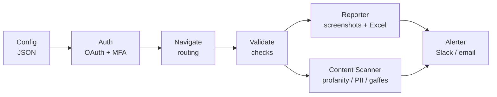

# Playwright Feature Validator

<p align="center">
  
</p>

<p align="center">
  <strong>It logs into your app, clicks through every feature, and tells you what broke before your customer does.</strong>
</p>

<p align="center">
  <a href="https://github.com/thiagoger/playwright-feature-validator/actions/workflows/ci.yml"></a>
  
  
  
</p>

<p align="center">
  <a href="#features">Features</a> •
  <a href="#quick-start">Quick Start</a> •
  <a href="#configuration">Configuration</a> •
  <a href="#documentation">Documentation</a>
</p>

---

## Why this exists

A customer demo fails for the dumbest reasons: an API key expired overnight, a feature flag flipped, the seed data got wiped. Nobody notices until you're sharing your screen.

So I built a robot that does the boring check for you. It logs in (OAuth, MFA, the works), walks through every feature on a schedule, screenshots the evidence, scores each screen, and pings Slack the moment something stops working. By the time you open the demo, you already know it's green.

This is the framework behind a validation engine I run across 29 features of a real product.

## Features

- **🔐 Auto Login** - Handles OAuth, MFA/TOTP, session management
- **🧭 Smart Navigation** - Declarative routing with fallbacks
- **📸 Evidence Capture** - Screenshots with annotations
- **✅ Validation Engine** - Check elements, data, API responses
- **🛡️ Content Scanner** - Bilingual profanity/gaffe/PII shield for demo safety
- **🔔 Alerting** - Slack, email, webhooks on failure
- **📊 Reporting** - Excel/JSON reports with history
- **⏰ Scheduling** - Run daily, hourly, or on-demand

## Quick Start

### Prerequisites

- Python 3.9+
- Chrome browser
- Playwright

### Installation

```bash
# Clone the repository
git clone https://github.com/thiagoger/playwright-feature-validator.git
cd playwright-feature-validator

# Create virtual environment
python -m venv venv
source venv/bin/activate  # On Windows: venv\Scripts\activate

# Install dependencies
pip install -r requirements.txt

# Install Playwright browsers
playwright install chromium
```

### First Run

```bash
# Copy environment template
cp .env.example .env

# Edit .env with your credentials
# Then run:
python -m feature_checker run --product example --project demo
```

## Architecture



## Configuration

### Product Configuration

Define your product in `config/products/`:

```json
{
  "name": "ExampleApp",
  "base_url": "https://app.example.com",
  "auth": {
    "type": "oauth_totp",
    "login_url": "/sign-in"
  },
  "projects": {
    "demo": {
      "companies": ["Acme", "Globex", "Initech"]
    }
  }
}
```

### Health Checks

Define checks in `config/checks/`:

```json
{
  "product": "ExampleApp",
  "checks": [
    {
      "id": "login-works",
      "name": "Login Works",
      "type": "auth",
      "priority": "critical",
      "expect": {
        "url_contains": "/homepage"
      }
    },
    {
      "id": "customers-exist",
      "name": "Customers Have Data",
      "type": "navigation",
      "priority": "high",
      "route": "/app/customers",
      "expect": {
        "selector": "[data-testid='customer-row']",
        "min_count": 1
      }
    }
  ]
}
```

## CLI Reference

```bash
# Run all checks for a product
feature-checker run --product example

# Run specific project
feature-checker run --product example --project demo

# Run single check
feature-checker run --product example --check login-works

# Dry run (no screenshots, no alerts)
feature-checker run --product example --dry-run

# Generate report only
feature-checker report --product example --format excel

# List available checks
feature-checker list --product example
```

## Check Types

| Type | Description | Example |
|------|-------------|---------|
| `auth` | Validate login works | Login → expect homepage |
| `navigation` | Navigate and validate | Go to page → check element exists |
| `content_scan` | Scan page for profanity/PII/gaffes | Navigate → scan text → flag violations |
| `api` | Call API endpoint | GET /health → expect 200 |
| `data` | Validate data exists | Query → expect count >= N |
| `ui` | Check UI element | Find element → validate text |

## Alerting

Configure alerts in `.env`:

```env
# Slack
SLACK_WEBHOOK_URL=https://hooks.slack.com/services/xxx
SLACK_CHANNEL=#demo-health

# Email
SMTP_HOST=smtp.gmail.com
SMTP_PORT=587
ALERT_EMAIL=team@company.com
```

## Documentation

| Document | Description |
|----------|-------------|
| [Getting Started](docs/getting-started.md) | Installation and first run |
| [Configuration](docs/configuration.md) | Product and check setup |
| [Adding Checks](docs/adding-checks.md) | How to add new checks |
| [Architecture](docs/architecture.md) | System design |
| [API Reference](docs/api-reference.md) | Module documentation |

## Project Structure

```
playwright-feature-validator/
├── src/feature_checker/
│   ├── cli.py              # Command-line interface
│   ├── core/
│   │   ├── checker.py      # Main check orchestrator
│   │   ├── browser.py      # Browser management
│   │   ├── content_scanner.py  # Profanity/PII/gaffe detection
│   │   └── reporter.py     # Report generation
│   ├── auth/
│   │   ├── login.py        # Login handlers
│   │   └── totp.py         # TOTP generation
│   ├── navigation/
│   │   └── navigator.py    # Page navigation
│   └── utils/
│       ├── screenshot.py   # Screenshot capture
│       └── config.py       # Configuration loader
├── config/
│   ├── checks/             # Check definitions
│   └── products/           # Product configurations
├── docs/                   # Documentation
├── examples/               # Usage examples
└── tests/                  # Test suite
```

## Contributing

1. Fork the repository
2. Create a feature branch (`git checkout -b feature/amazing`)
3. Commit changes (`git commit -m 'Add amazing feature'`)
4. Push to branch (`git push origin feature/amazing`)
5. Open a Pull Request

## License

MIT License - see [LICENSE](LICENSE) for details.

---

<p align="center">
  Built and maintained by Thiago Rodrigues
</p>
